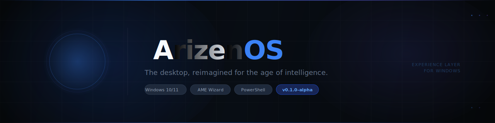

<div align="center">



<br/>

[](https://github.com/Alrizz-art/ArizenOS/releases)
[](LICENSE)
[](https://github.com/Alrizz-art/ArizenOS)
[](https://ameliorated.io)
[](https://github.com/Alrizz-art/ArizenOS/stargazers)
[](https://github.com/Alrizz-art/ArizenOS/issues)
[](https://github.com/Alrizz-art/ArizenOS/releases)

<br/>

**ArizenOS** transforms a stock Windows installation into an intelligent, privacy-first desktop experience — clean, fast, and developer-ready. Delivered as a single `.apbx` playbook for [AME Wizard](https://ameliorated.io).

<br/>

[**Download .apbx**](https://github.com/Alrizz-art/ArizenOS/releases/latest) · [Documentation](#getting-started) · [Roadmap](#roadmap) · [Contributing](CONTRIBUTING.md)

</div>

---

## Overview

ArizenOS is not a new operating system — it is the **experience layer Windows was never built to be.**

It applies a curated set of registry tweaks, branding assets, and performance optimizations to Windows 10/11 via AME Wizard — transforming the default desktop into a refined, AI-ready workspace. Every change is reversible via a one-click rollback.

```
┌─────────────────────────────────────────────────────────┐
│  Your Windows 10 / 11 Installation                      │
│                                                         │
│  ╔═══════════════════════════════════════════════════╗  │
│  ║              ArizenOS Experience Layer            ║  │
│  ║                                                   ║  │
│  ║  OEM Branding · Dark Mode · Transparency          ║  │
│  ║  Performance · Dev Tools · Wallpapers · Rollback  ║  │
│  ╚═══════════════════════════════════════════════════╝  │
└─────────────────────────────────────────────────────────┘
```

---

## What's Applied

| Phase | What It Does |
|---|---|
| 🔍 **Preflight** | Validates OS build, admin rights, disk space, S-Mode, domain status |
| 🛡️ **Safety Net** | Creates System Restore Point + full registry backup before any changes |
| 📦 **Asset Deploy** | Stages branding assets to `%ProgramData%\ArizenOS\` |
| 🏷️ **OEM Branding** | Writes ArizenOS identity to System Info, About page, Control Panel |
| 🖼️ **Lock Screen** | Sets branded lock screen via dual-path (Policy + PersonalizationCSP) |
| 🌑 **Dark Theme** | Forces dark mode system-wide (apps + taskbar + Start) |
| 💎 **Transparency** | Enables Aero Peek, DWM composition, live thumbnails |
| ⚡ **Performance** | Applies visual effects profile + UserPreferencesMask per OS build |
| 🛠️ **Developer** | *(Optional)* Developer Mode, long paths, WinGet packages, VS Code |
| ✅ **Finalize** | Writes install manifest, registers rollback shortcut in Start Menu |
| ↩️ **Rollback** | Full reversal — restores registry, removes assets, cleans shortcuts |

All changes are **idempotent** and **fully reversible**.

---

## Quick Install

> **Prerequisites:** Windows 10 22H2 (build 19045+) or Windows 11 · Administrator account · [AME Wizard](https://ameliorated.io)

**1. Download the playbook**

```
https://github.com/Alrizz-art/ArizenOS/releases/latest/download/ArizenOS.apbx
```

**2. Load in AME Wizard**

```
AME Wizard → Load Playbook → ArizenOS.apbx → Run
```

**3. Roll back anytime**

```
Start Menu → ArizenOS → Rollback ArizenOS
```

> ⚠️ **Test in a VM first.** ArizenOS v0.1.0 is alpha software. Always verify in a non-production environment before applying to your main machine.

---

## Roadmap

| Status | Component | Description |
|:---:|---|---|
| ✅ | **ArizenOS Playbook** | `.apbx` — 13 scripts, 10 phases, full rollback |
| ✅ | **Branding System** | Logo, wallpapers, OEM identity, design tokens |
| ✅ | **Performance Layer** | Visual effects, DWM, prefetch, menu timing |
| ✅ | **Developer Setup** | Dev Mode, long paths, WinGet toolchain |
| 🔄 | **Desktop Glass Layer** | Blur, MICA, acrylic rendering engine |
| 🔄 | **Launcher** | AI-powered command palette |
| 🔄 | **Assistant** | Conversational AI with full desktop context |
| 🔄 | **Voice Control** | Voice-activated desktop control |
| 🔄 | **Agent Runtime** | Autonomous task agent with tool access |
| 🔄 | **Extension Hub** | Plugin manager and integration center |

---

## Repository Layout

```
ArizenOS/
├── playbook/
│   ├── entries/          # 11 AME Wizard phase YAML files (01–10 + rollback)
│   ├── manifests/        # Playbook, registry, asset & script manifests
│   └── scripts/          # Script stubs and documentation
│
├── scripts/              # 13 PowerShell scripts (SCR-01 through SCR-13)
│   ├── preflight-check.ps1
│   ├── backup-registry.ps1
│   ├── apply-oem-branding.ps1
│   ├── apply-wallpaper.ps1
│   ├── apply-theme.ps1
│   ├── apply-performance.ps1
│   ├── rollback.ps1
│   └── build-apbx.ps1    # APBX assembly script
│
├── assets/
│   ├── logos/            # OEM logo (BMP 120×120), PNG variants
│   └── wallpapers/       # Dark, default, lock screen (4K JPEG)
│
├── apps/                 # Planned: Launcher, Assistant, Voice, Agent, Hub
├── packages/             # Planned: Glass engine, AI layer, UI library
├── registry/             # Standalone .reg files for manual application
├── research/kernel/      # Experimental bare-metal OS prototype (x86_64)
└── .github/
    ├── workflows/        # CI/CD — build, release, security, nightly
    └── assets/           # Banner, screenshots
```

---

## Build From Source

To assemble `ArizenOS.apbx` from the repository:

```powershell
# Clone
git clone https://github.com/Alrizz-art/ArizenOS.git
cd ArizenOS

# Run as Administrator in PowerShell
.\scripts\build-apbx.ps1
# → ArizenOS.apbx generated at repo root
```

The build script validates all 36 required files, stages the APBX structure, computes SHA256 asset hashes, and packages the archive.

---

## Architecture

ArizenOS is built on three layers:

```
┌─────────────────────────────────────────────────┐
│  Layer 3 — Applications                         │
│  Launcher · Assistant · Voice · Agent · Hub     │
├─────────────────────────────────────────────────┤
│  Layer 2 — Platform Packages                    │
│  @arizen/glass · @arizen/mind · @arizen/shell   │
├─────────────────────────────────────────────────┤
│  Layer 1 — OS Configuration (this repo)         │
│  AME Wizard Playbook · 13 Scripts · Rollback    │
└─────────────────────────────────────────────────┘
```

Architecture decisions are recorded as ADRs in [`docs/architecture/`](docs/architecture/):

| ADR | Decision |
|---|---|
| [ADR-0001](docs/architecture/ADR-0001-monorepo.md) | Monorepo structure |
| [ADR-0002](docs/architecture/ADR-0002-glass-rendering.md) | Glass rendering engine |
| [ADR-0003](docs/architecture/ADR-0003-local-ai.md) | Local-first AI |
| [ADR-0004](docs/architecture/ADR-0004-kernel-research-strategy.md) | Kernel research separation |

---

## Script Reference

| ID | File | Phase | Description |
|---|---|---|---|
| SCR-01 | `preflight-check.ps1` | Preflight | OS build, elevation, S-Mode, disk, domain |
| SCR-02 | `create-restore-point.ps1` | Safety Net | Windows System Restore Point |
| SCR-03 | `backup-registry.ps1` | Safety Net | Full registry export to `.reg` |
| SCR-04 | `deploy-assets.ps1` | Asset Deploy | Copy branding + wallpapers to ProgramData |
| SCR-05 | `apply-oem-branding.ps1` | OEM Branding | Write OEM registry values + logo path |
| SCR-06 | `apply-wallpaper.ps1` | Lock Screen | Set desktop + lock screen wallpapers |
| SCR-07 | `apply-theme.ps1` | Theme | Dark mode, transparency, DWM tweaks |
| SCR-08 | `apply-performance.ps1` | Performance | Visual effects profile + UserPreferencesMask |
| SCR-09 | `apply-developer.ps1` | Developer | Dev Mode, long paths, WinGet packages |
| SCR-10 | `write-manifest.ps1` | Finalize | Write JSON install manifest |
| SCR-11 | `register-rollback.ps1` | Finalize | Create Start Menu rollback shortcut |
| SCR-12 | `finalize.ps1` | Finalize | Final log entry + artifact verification |
| SCR-13 | `rollback.ps1` | Rollback | Full system reversal from backup |

---

## Contributing

Contributions are welcome. Please read [CONTRIBUTING.md](CONTRIBUTING.md) before opening a PR.

- **Platform** — TypeScript, React, Windows shell APIs, design tokens
- **Playbook** — PowerShell, AME Wizard YAML, registry research
- **Kernel** — C, Assembly, systems programming (see `research/kernel/`)

See [GOVERNANCE.md](GOVERNANCE.md) for maintainer processes and review standards.

---

## Security

Found a vulnerability? See [SECURITY.md](SECURITY.md) for responsible disclosure guidelines.

---

## License

[MIT](LICENSE) — Copyright © 2026 ArizenOS Contributors

---

<div align="center">

Made with precision for Windows power users, developers, and privacy advocates.

<br/>

**[⬆ Back to top](#)**

</div>
